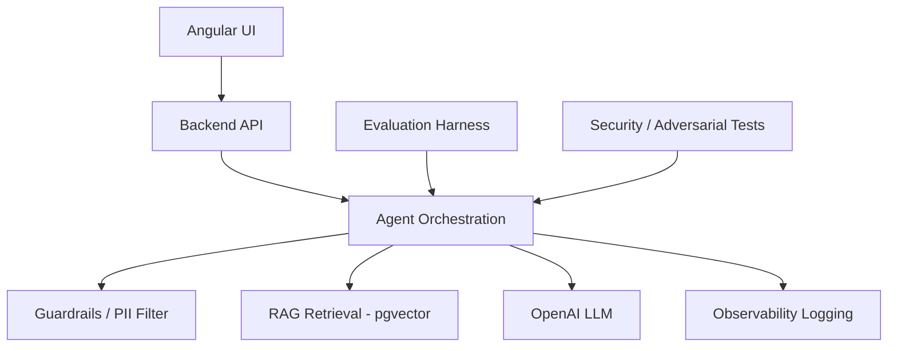

# ro-insights-engine

# RO Insights Engine — AI-Powered Repair Order Review

An end-to-end demo of an AI agent system that reviews automotive Repair Orders (ROs) and generates insights: damage classification, labor/parts analysis, warranty eligibility, and warranty reimbursement uplift opportunities.

Built as a **layered, loosely-coupled architecture** so any layer (LLM provider, vector store, orchestration engine, frontend) can be replaced independently.

> **Scope note:** This is a technical demonstration of architecture and agentic AI patterns, not a production warranty-claims tool. All repair order data is synthetic. State warranty reimbursement rules referenced here are illustrative and do not represent actual law or OEM policy.

---

## Architecture



| Layer | Purpose | Tech | Status |
|---|---|---|---|
| RAG / Data | Ingests and retrieves warranty-rule reference documents | PostgreSQL + pgvector, OpenAI embeddings | ✅ Working |
| Agent Orchestration | State machine: classify → extract → retrieve → compute → approve | Python, retry logic, human-approval gating | ✅ Working |
| Observability | Traces every run: steps, tokens, latency, failures | JSONL structured logging | ✅ Working |
| Evaluation | Compares agent output against hand-labeled expected results | Custom harness, 7 synthetic test ROs | ✅ Working (6/7 pass, documented gap below) |
| Guardrails / PII | Scrubs PII before LLM calls; restricts agent to an action allow-list | Regex-based scrubber, allow-list enforcement | ✅ Working |
| AI Testing / Security | Adversarial prompt-injection resistance testing | Custom test suite | ✅ Working (2/2 pass) |
| Backend API | HTTP interface to the orchestration pipeline | FastAPI (Python) | 🔲 Not yet built |
| UI | User-facing interface for reviewing ROs and insights | Angular | 🔲 Not yet built |

---

## Warranty Uplift Use Case

Given a Repair Order, the agent generates:

1. **Damage classification** — category (`MECHANICAL`, `ELECTRICAL`, `ENGINE`, `COLLISION`, `BRAKE`), sub-category, severity, confidence — via LLM reasoning over technician findings.
2. **Warranty labor-rate uplift opportunity** — compares the submitted labor rate against a RAG-retrieved, state-specific reference rate. Flags the potential additional reimbursement if the dealer under-submitted.
3. **Eligibility gating** — opportunities are only computed for ROs with `payment_classification` in `{WARRANTY, EXTENDED_WARRANTY}` and `warranty.coverage_status == ELIGIBLE`. Collision damage, expired warranties, and customer-pay ROs correctly yield zero opportunities.
4. **Approval gating** — any opportunity above $50 is flagged `NEEDS_APPROVAL` rather than auto-submitted, simulating a human-in-the-loop checkpoint.

### Scoped out (documented, not implemented)
To keep the demo focused, the following insight types from the original brief are represented in the test data's expected outputs but not implemented in the agent logic:
- `WARRANTY_PARTS_MARKUP` (parts pricing uplift)
- `DATA_COMPLETENESS` (missing diagnostic documentation checks — this is why RO-005 fails evaluation; see below)
- `WARRANTY_ELIGIBILITY` explicit recommendation output (the eligibility gate itself works correctly, but doesn't emit a structured recommendation object)

These are natural next additions — the data model and RAG corpus already support them.

---

## How to run

### Prerequisites
- Docker Desktop
- Python 3.13, `venv`
- An OpenAI API key with billing enabled

### 1. Start the database
```bash
docker-compose up -d
```

### 2. Set up environment variables
```bash
cp .env.example .env
# edit .env and fill in your real Postgres and OpenAI credentials
```

### 3. Set up Python environment
```bash
python3 -m venv venv
source venv/bin/activate
pip install -r packages/rag/requirements.txt
pip install -r packages/agent-orchestration/requirements.txt
```

### 4. Create the database schema
```bash
docker exec -it ro-insights-db psql -U roadmin -d ro_insights -c "CREATE EXTENSION IF NOT EXISTS vector;"
docker exec -it ro-insights-db psql -U roadmin -d ro_insights -c "
CREATE TABLE warranty_rule_chunks (
    id SERIAL PRIMARY KEY,
    state TEXT NOT NULL,
    source_doc TEXT NOT NULL,
    chunk_text TEXT NOT NULL,
    embedding vector(1536)
);"
```

### 5. Ingest the warranty-rule reference documents into pgvector
```bash
python3 packages/rag/ingest.py
```

### 6. Run the full agent pipeline against all sample ROs
```bash
python3 packages/agent-orchestration/orchestrator.py
```

### 7. Run the evaluation harness
```bash
python3 packages/evaluation/run_eval.py
```

### 8. Run the security/adversarial test suite
```bash
python3 packages/security/adversarial_tests.py
```

### 9. Inspect observability logs
```bash
cat packages/observability/logs/runs.jsonl
```

---

## Repository structure

```
ro-insights-engine/
├── apps/
│   ├── ui-angular/            # (not yet built)
│   └── api-backend/           # (not yet built)
├── packages/
│   ├── rag/                   # pgvector ingestion + retrieval
│   ├── agent-orchestration/   # state machine, LLM calls, business logic
│   ├── observability/         # run tracing, token/latency logging
│   ├── evaluation/            # eval harness against expected outputs
│   ├── guardrails/            # PII scrubbing, action allow-list
│   └── security/               # adversarial/prompt-injection tests
├── data/
│   ├── sample-ros/            # 7 synthetic Repair Orders (agent input)
│   ├── warranty-rules/        # WA/OR reference rule documents (RAG corpus)
│   └── eval/expected_outputs/ # hand-labeled answer keys for evaluation
└── docker-compose.yml
```
## Design decisions worth noting

- **pgvector chosen over a dedicated vector DB** to keep the stack to one database for both relational and vector data — appropriate for this scale, would reconsider at production scale/scale-out requirements.
- **Eligibility gating happens in code, not the LLM** — payment classification and warranty coverage status are deterministic business rules, not something that should depend on LLM judgment. The LLM is only used for damage classification, where natural-language reasoning is genuinely needed.
- **Retry logic wraps only the LLM call**, not the whole pipeline — deterministic steps (labor math, eligibility checks) don't need retries; only the non-deterministic, network-dependent LLM call does.
- **`temperature` parameter removed** — the chosen model (`gpt-5-mini`) only supports its default temperature; this is documented here rather than silently worked around.
- **Evaluation grading is scoped to implemented opportunity types** — grading the agent against opportunity types it was never built to produce would be a misleading test, not a stricter one.

---

## Known limitations

- RO-005 fails evaluation because its expected insight (`DATA_COMPLETENESS`) is a workflow type not yet implemented — see "Scoped out" above.
- Damage-category taxonomy is a fixed 5-value set constrained via prompt; a production system would likely use a larger, versioned taxonomy with a proper classification model or fine-tuned classifier.
- Warranty reference rates are hardcoded per state in the orchestrator rather than extracted from the retrieved RAG chunk text via a second LLM call — a reasonable next step for a fuller build.
- No backend API or UI yet; the system is currently demonstrated via CLI scripts.